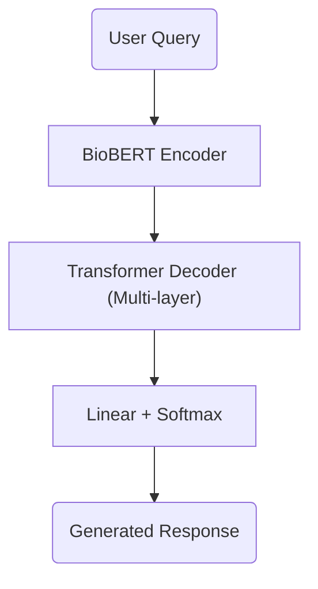

# 🏥 Medical AI Chatbot with BioBERT + Transformer Decoder

> **Scope** · Personal project, built on my own time. Not actively maintained — it is finished, not tended.
>
> **Committed on purpose:** `chatbot.log` is a real training and inference log, kept so behaviour is inspectable without rerunning a three-week training job. Weights are distributed separately via `setup.py`.

> [!NOTE]
> **Built 2025. The ecosystem has moved since.**
> Dependencies here are unpinned, so a clean `pip install` today resolves to
> versions that did not exist when this was written and pandas 3.0, numpy 2.5 plus major releases of torch, ultralytics and transformers have all landed since. Expect install or
> runtime breakage on a fresh environment. What is on offer is the engineering
> approach and the decisions behind it, not a guaranteed-green build.
> Happy to bring it current if that would be useful — just ask.

A research-grade medical Q&A chatbot combining [BioBERT](https://arxiv.org/abs/1901.08746) embeddings with a custom multi-layer Transformer decoder. Built from scratch in PyTorch, with a local Streamlit interface supporting both **Nucleus Sampling** and **Beam Search**.

---

## Running it

Runs locally in a few minutes - model weights download automatically via
`setup.py`. There is no hosted demo; the model does not fit in free-tier memory,
and a link that dies quietly is worse than no link.

---

## 📦 Features

- 🧠 **Model:** BioBERT encoder + multi-layer Transformer decoder with causal masking  
- 🔁 **Training:** AMP, OneCycleLR scheduler, checkpointing, early stopping, label smoothing  
- 🎛️ **Inference:** Dual-mode decoding (Beam Search, Nucleus Sampling) with adjustable parameters  
- 🧪 **Dataset:** 260K+ real-world doctor–patient Q&A pairs  
- 🖥️ **Streamlit UI:** Interactive, with chat history, temperature, top-p, and max token settings  

---

## 🧰 Requirements

Install dependencies:

```bash
pip install -r requirements.txt
````

---

## 🗂️ File Structure

```
.
├── streamlit_nucleus.py           # Nucleus sampling interface
├── streamlit_beam_search.py      # Beam search interface
├── training.py                   # Full training pipeline
├── requirements.txt              # Python dependencies
├── setup.py                      # Downloads and extracts model weights/tokenizer from Google Drive
├── final_model/                  # Populated after setup.py (model weights + tokenizer)
├── checkpoints/                  # Intermediate training checkpoints (optional)
└── processed_data/               # Dataset folder (not included in repo)
```

---

## 📥 How to Run Locally

1. **Download model weights + tokenizer**

```bash
python setup.py
```

This downloads a pre-trained model archive from Google Drive (`Chatbot_Medical_Advice.zip`) and extracts `final_model/`.

2. **Start Streamlit UI**

* Nucleus Sampling (creative generation)

```bash
streamlit run streamlit_nucleus.py
```

* Beam Search (deterministic generation)

```bash
streamlit run streamlit_beam_search.py
```

Open [http://localhost:8501](http://localhost:8501) in your browser.

---

## 🧪 Example Prompts

* What are the symptoms of hypertension?
* How is diabetes diagnosed?
* What causes migraine headaches?
* What are the risk factors for heart disease?

---

## 🧠 Model Architecture



* Encoder: `dmis-lab/biobert-base-cased-v1.1`
* Decoder: 4-layer Transformer, 8 attention heads, causal mask
* Loss: Cross-entropy with label smoothing; padded tokens ignored

---

## 📈 Training Details

* Optimizer: AdamW with OneCycleLR scheduler
* Mixed Precision (AMP) for speed and memory efficiency
* Early stopping and checkpointing enabled
* Final best validation loss: **3.1681** at **epoch 18**
* Training machine: **ASUS ROG Strix G15** (i7 CPU + NVIDIA RTX 3060 GPU)
* Training duration: \~3 weeks on 260K+ samples

---

## 📤 Download Model & Full Project

You can download the **entire project** (including trained weights, tokenizer, training scripts, and inference UI) here:

📦 [Google Drive – Chatbot\_Medical\_Advice.zip](https://drive.google.com/file/d/1uZiGAX3XCpnjJnEhwmu1Ds8il0dmEbAt/view?usp=sharing)

After downloading:

```bash
unzip Chatbot_Medical_Advice.zip
cd Chatbot_Medical_Advice
streamlit run streamlit_nucleus.py
```

---

## ⚠️ Disclaimer

This project and model are intended for **educational and research use only**.
It is **not a substitute for professional medical advice, diagnosis, or treatment**.
Always consult a licensed healthcare provider for medical concerns.

> 🧠 **Note:** Due to computational constraints (limited VRAM and training time), the model architecture is intentionally lightweight and may not match production-grade performance. The outputs reflect those limitations.

---
